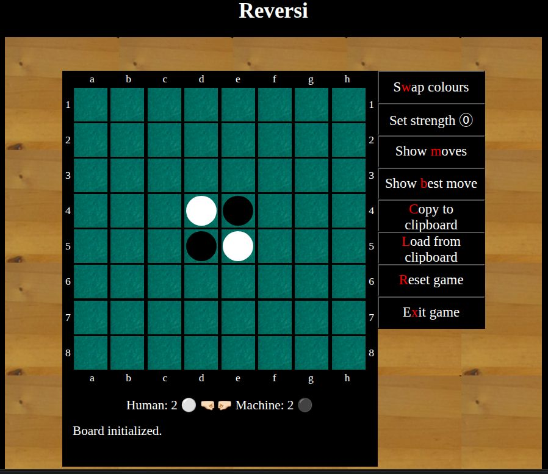

# Reversi game
  
In the directory at hand you will find an application, in which the user can play Reversi (aka Othello) against the machine.

## Technology
The application uses TypeScript and SASS and has to be launched with the framework vite (no other packages are needed).

## Overview
The user can play the game Reversi with the computer (details about the game can be found
in [Wikipedia](https://en.wikipedia.org/wiki/Reversi)). The strength of the computer can
be set at any time (number of possible moves to be investigated).
At the lowest level of strength, the computer places a stone at random at a legal position.
It is possible to ask the computer for a good move with respect to the set strength.
The board is presented at bird's eye view. It is possible to show all legal positions
for the next move. After placing a stone for all captured stones a small animation is shown.

### The GUI
After launching, the board is presented to the user:



Buttons (for each button exists a keystroke, which is highlighted as a red character):
+ Swap colours (w): before starting the game, the user can choose his colour. During the game the colour cannot be changed.  
+ Set strength (s): the strength of the machine is defined by the number of half moves to be investigated, while the machine's
  move is been computed (possible values: 0..5). A value of 0 means, that the machine chooses a possible move by random.  
+ Show moves (m): shows all possible moves.  
+ Show best move (b): computes the best move according to the given strength.  
+ Copy to clipboard (c): the current state of the game ( stones, user colour, machine strength) is copied as a JSON object to the clipboard, so the game state can be stored in a file.  
  See the files `init.json` and `three_stones.json` as examples.  
+ Load from clipboard (l): read an JSON object with the representation of a game state. The current game is lost.  
+ Reset game (r): erase current game state and initialize the game with the start state.  
+ Exit game (x): close the application. The current game state is stored in the local session storage.

When the application is launched, the local storage is examined for a stored game state. The user can choose between 
the stored game state or a fresh start state.
The game starts with the first move of the user. Rotating stones are shown by a small animation.
If the user cannot place a stone, the next move of the machine is computed automatically (useful information
is presented below the board). The game stopps, if no one can make a move. The player, who has more stones
on the board, is the winner (the current number of stones for each player is given right under the board).

## Folder structure

```shell
├── index.html  # Entry point of the application.
├── pics        # Folder with pictures for stones and fields.
├── src
│   ├── board.ts      # TypeScript file with application logic (game engine).
│   ├── init.json     # JSON file with board snapshot of the start state.
│   ├── reversi.sass  # SASS layout file for the GUI.
│   ├── reversi.ts    # TypeScript file with GUI logic.
│   └── three_stones.json # JSON file with an example of a board snapshot.
└── tsconfig.json   # Configuration file for TypeScript.
```


## Installation

To install vite and run the application, use the following commands:

```shell
 # Initialize vite with TypeScript support:
npm create vite@latest
-> vanilla
-> TypeScript

 # Install package to process SASS code:
npm install -D sass-embedded

 # Run application:
npm run dev
```

## What you can learn from the source code
While reading the source code you can learn, how to ...
+ implement a full (and not trivial) game only with TypeScript and SASS without any additional packages,
+ store/load JSON code to/from the clipboard,
+ implement a modal dialogue in TypeScript with Promises,
+ implement a search tree for a two-people-game with full knowledge,
+ apply alpha-beta-pruning to find the best move in a search tree,
+ implement a small animation of a rotating black/white stone,
+ handle keyboard events.


